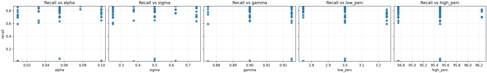
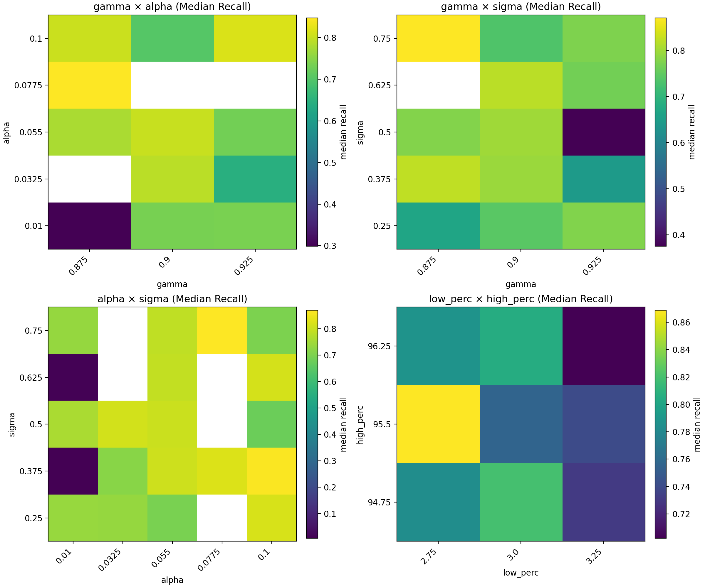
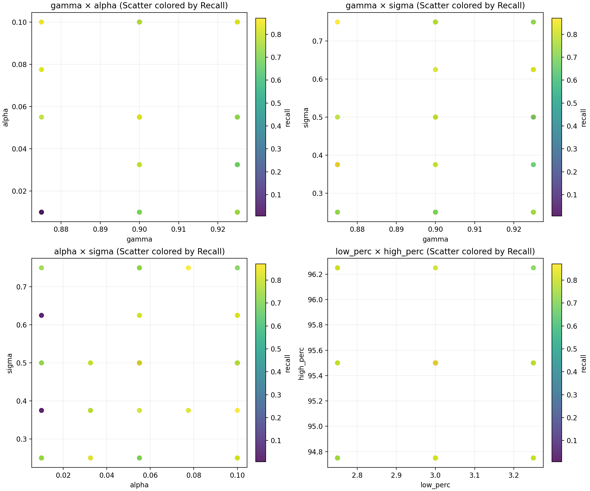
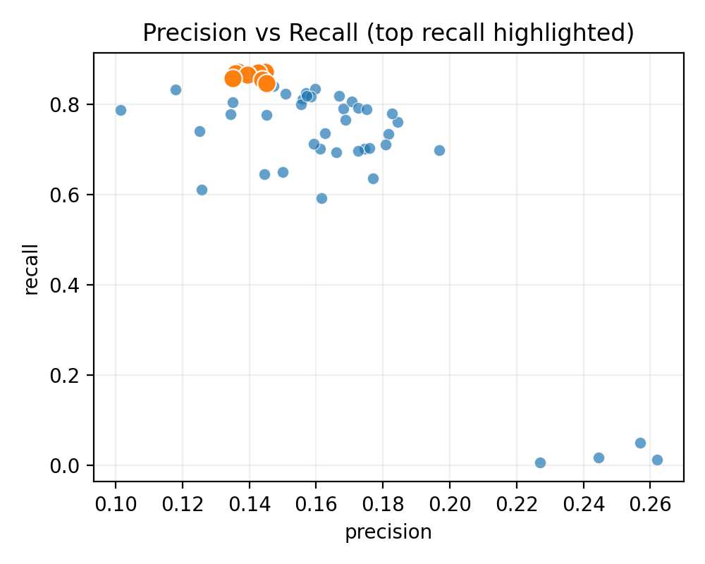

# Capstone Project — Final Report
## Image Quality as a Hyperparameter

---

## 1. Problem Statement
Modern computer vision pipelines often assume model architecture is the primary performance lever. In practice, **input image quality** can be the binding constraint. This project evaluates whether controlled image enhancement—applied consistently to both training and inference imagery—can measurably change downstream detection performance under a **fixed training regime**.

By holding the model architecture, training procedure, and epoch count constant across runs, the analysis isolates how systematic changes to image characteristics influence model behavior.

---

## 2. Model Outcomes / Predictions
- **Task:** Supervised object detection (tree-point prediction)
- **Model:** Green City Tree Point Prediction (TPP)
- **Architecture:** VGG-style SFANet (unchanged across experiments)
- **Training regime:** Fixed 15-epoch schedule per run
- **Primary metric:** Recall
- **Secondary metrics:** Precision, F1, false positives, spatial distance

The model is retrained consistently for each experiment using the same procedure and hyperparameters. Observed performance differences are attributed to changes in **input imagery**, not training variability.

---

## 3. Data Acquisition
- **Ground truth:** Street ROW Trees — City of Pasadena, CA  
- **Imagery:** NAIP aerial imagery (chip-based ingestion)
- **Experiment scope:** ~50 completed CVE runs with full training, inference, and evaluation

---

## 4. Data Preprocessing / Preparation
Image chips are modified using parameterized computer-vision enhancements:
- **Sharpening:** strength (`alpha`) and scale (`sigma`)
- **Contrast stretching:** percentile bounds (`low_perc`, `high_perc`)
- **Brightness:** gamma correction (`gamma`)

For each configuration, enhanced imagery replaces the working input set, followed by dataset preparation, training, inference, and evaluation using an identical pipeline.

---

## 5. Modeling
All experiments use the same model architecture and training workflow:
- Dataset preparation
- Training for a fixed 15 epochs
- Inference on enhanced imagery
- Standardized evaluation

Enhancement parameters function as **data-level hyperparameters**, allowing performance differences to be attributed to image characteristics rather than model design.

---

## 6. Model Evaluation
Each run is evaluated using:
- Recall (primary)
- Precision and F1
- False positives / false negatives
- Mean distance to closest predicted tree

Metrics are logged and aggregated across runs to support interaction analysis and comparative visualization.

---

## 7. Results

### Figure 1 — Recall vs Image Parameters

*Recall varies nonlinearly across individual enhancement parameters, motivating interaction-based analysis.*

---

### Figure 2 — Interaction Heatmaps (Median Recall)

*Median recall surfaces show strong interaction effects among enhancement parameters. Brightness conditions sharpening behavior, while contrast window geometry exhibits bounded performance regimes.*

---

### Figure 3 — Interaction Scatter Support

*Run-level scatter confirms that interaction surfaces are supported by the underlying data rather than binning artifacts.*

---

### Figure 4 — Precision–Recall Across CVE Runs

*Across all enhancement schedules, the model exhibits coherent behavior. Recall shifts systematically under different image conditions while precision degrades gradually, indicating stable training and inference.*

---

## 8. Findings
-Image enhancement parameters function as data-level hyperparameters, measurably influencing detection performance under an otherwise fixed training regime.  
-Interaction effects dominate model response. Brightness consistently conditions the impact of sharpening, while sharpening strength and scale exhibit coupled behavior that cannot be inferred from single-parameter analysis.  
-Contrast adjustments affect performance within bounded regions; aggressive percentile clipping degrades recall, indicating that enhancement geometry matters more than magnitude.  
-Across approximately 50 enhancement schedules, recall varied systematically while model behavior remained coherent, indicating that observed performance differences are attributable to changes in input imagery rather than instability in training or inference.  
-These results demonstrate that improvements in visual clarity do not necessarily translate to improved detection, underscoring the importance of model-aware image engineering.  

---

## 9. Next Steps
## Next Steps

- **Interaction-safe enhancement bands:** Formalize “safe operating regions” for combined enhancements (e.g., brightness × sharpening), identifying parameter ranges that consistently preserve or improve recall and ranges that reliably degrade performance.

- **Automated schedule generation (feedback-driven search):** Use accumulated experiment results (e.g., recall response surfaces) to adaptively propose new CVE configurations—prioritizing promising regions and avoiding harmful interactions—transforming parameter sweeps into an iterative, data-informed search process.

- **Constraint-based enhancement rules:** Encode learned “do-not-combine” or “combine-with-care” rules (for example, sharpening–brightness regimes that introduce artifacts) as guardrails for future image enhancement pipelines.

- **Multi-objective optimization:** Extend the analysis to optimize recall subject to explicit constraints on false positives or spatial error, enabling selection of enhancement configurations along a practical Pareto frontier.

